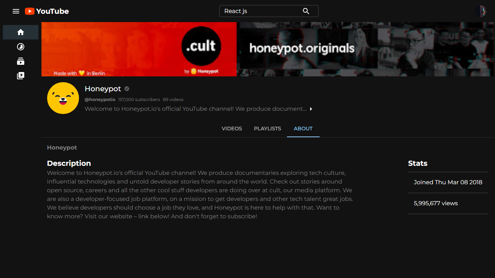
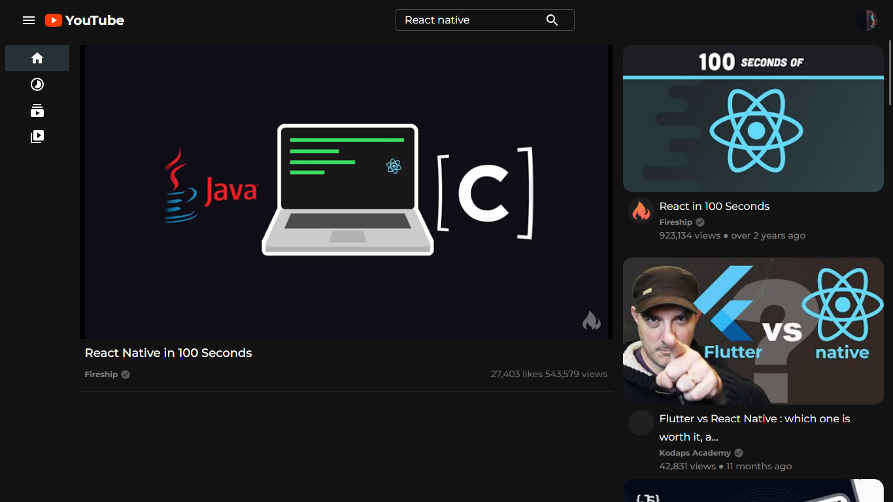

# YouTube Clone Application

## Description

The YouTube Clone Application is a web-based application that aims to replicate the core features and functionalities of the popular video-sharing platform, YouTube. This application allows users to watch and share videos.

## Screenshots

<table>
  <tr>
    <td>Home Page</td>
    <td>Channel Page</td>
  </tr>
  <tr>
    <td></td>
    <td></td>
  </tr>
 </table>
 
<table>
  <tr>
    <td>Channel About-Section</td>
    <td>Streaming Video</td>
  </tr>
  <tr>
    <td></td>
    <td></td>
  </tr>
 </table>

## Features

- Video playback and streaming
- User profiles and channel pages
- Search functionality
- Trending and popular videos

## Demo

You can check out a live demo of the YouTube Clone Application at [https://uvyoutube.netlify.app](https://uvyoutube.netlify.app).

## Installation

To install and run the YouTube Clone Application locally, follow these steps:

1. Clone this repository: `git clone https://github.com/Utkarshvr/youtube_clone_v1`
2. Navigate to the project directory: `cd youtube_clone_v1`
3. Install the dependencies: `npm install`
4. Run the application: `npm start`
5. Access the application in your browser at `http://localhost:3000`

## Technologies Used

- HTML5 and CSS3
- JavaScript (ES6+)
- React.js (Frontend)
- Other dependencies (check the `package.json` file)

## Contributing

Contributions are welcome! If you'd like to contribute to the YouTube Clone Application, please follow these steps:

1. Fork this repository
2. Create a new branch: `git checkout -b my-new-feature`
3. Make your changes and commit them: `git commit -am 'Add some feature'`
4. Push to the branch: `git push origin my-new-feature`
5. Submit a pull request

## Contact

If you have any questions, suggestions, or feedback, feel free to contact me at utkarshv995@gmail.com.

Happy Streaming!
